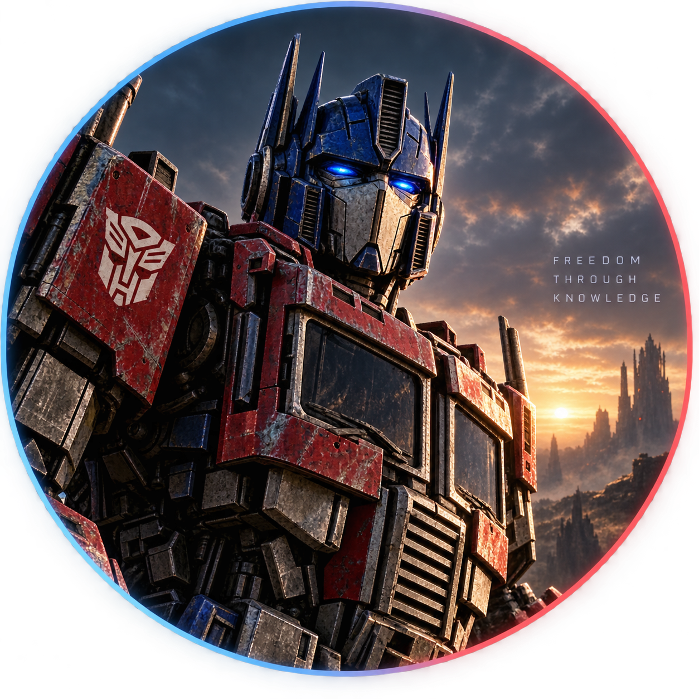

<h1>Hey, I'm Ayush Acharya</h1>

<h3>AI/ML Engineer • GenAI • Computer Vision • Intelligent Software</h3>

Building intelligent systems, experimenting with AI, and turning ideas into working software.

---

## About Me

I'm a Computer Science student focused on **Artificial Intelligence, Machine Learning, and intelligent software systems**.

- Building practical **AI/ML applications**
- Exploring **Generative AI, LLMs, RAG, and AI Agents**
- Working with **Computer Vision and Deep Learning**
- Exploring **LLM Security, Adversarial ML, and Privacy-Preserving AI**
- Turning ideas from **research → implementation → working systems**

---

## AI & ML Focus

  

  

---

## Tech Stack

### Languages

  

### AI / ML

  

### Backend & Tools

---

## GitHub Stats

---

## Featured Project

### AthleteSphere

<b>Embedding-Based Recommendation System</b>

A recommendation system using <b>semantic embeddings</b> to match athletes
with relevant opportunities based on their profiles and requirements.

---

## Currently Exploring

  

---

<i>Building intelligent systems, one experiment at a time.</i>

